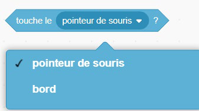
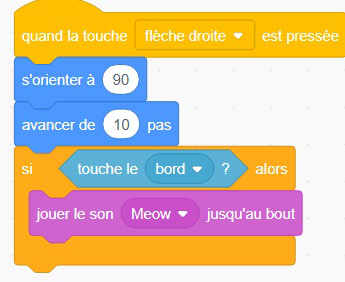
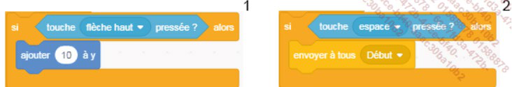
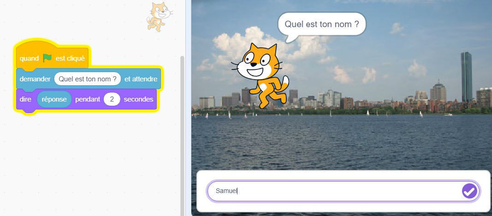

+++
title = "Les blocs Capteurs"
weight = 7
+++

# Les blocs Capteurs

Les blocs de type **Capteurs** servent à créer des conditions et à permettre des interactions entre les différents lutins d'un programme. Les blocs à valeurs aux extrémités pointues sont des blocs booléens utilisés pour définir ces conditions dans les blocs **Contrôle** vus précédemment.

| Bloc | Effet |
|---|---|
| `<touche [pointeur de la souris]>` | Renvoie « vrai » si l'élément choisi (le pointeur de la souris, le bord de la scène, un autre lutin) est touché. Souvent utilisé avec un bloc conditionnel. |
| `<touche la touche [espace] pressée>` | Vérifie si une touche précise du clavier est enfoncée. Si le résultat est « vrai », l'action associée est exécutée. |
| `demander () et attendre` | Affiche une bulle de dialogue qui pose une question à l'utilisateur et attend sa réponse. |
| `réponse` | Contient la dernière réponse saisie par l'utilisateur suite à un bloc `demander`. |

**Exemple** : un chat qui joue un son lorsqu'il touche le bord de la scène.

## Créer un dialogue

Le bloc `réponse` peut être associé au bloc `assembler () et ()`, situé dans la catégorie Opérateurs. Il permet d'intégrer la réponse apportée par l'utilisateur dans une phrase (par exemple : "Bonjour " + réponse + " !").

## Exercice — Faire connaissance

Quand on clique sur le drapeau vert, le lutin demande "Comment tu t'appelles ?". Il attend la réponse, puis dit "Enchanté, [réponse] !" en utilisant le bloc `assembler`.

*Objectif : combiner `demander`, `réponse` et `assembler` pour créer une conversation.*
