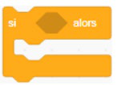
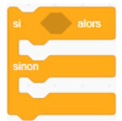

+++
title = "Les conditions"
weight = 6
+++

# Les conditions

Les blocs conditionnels exécutent les instructions qui leur sont attachées uniquement **si la condition est remplie**. Avant chaque exécution, le programme vérifie si la condition est vraie ou fausse : il s'agit de conditions de type **booléen**.

> En informatique, une **condition booléenne** correspond à une variable pouvant être dans l'état « vrai » ou « faux ».

Les blocs servant à créer ces conditions possèdent des espaces dans lesquels d'autres blocs, notamment issus des catégories **Capteurs** et **Opérateurs**, peuvent être insérés pour définir la condition. Ces blocs sont reconnaissables à leurs extrémités pointues et sont appelés **blocs à valeurs**.

| Bloc | Effet |
|---|---|
| `si <condition> alors` | Si la condition est vraie, le programme à l'intérieur du bloc s'exécute. Sinon, le contenu du bloc est ignoré et le script continue. Utilisée seule, sans boucle, la condition n'est vérifiée qu'une seule fois : il est donc conseillé de la placer à l'intérieur d'une boucle. |
| `si <condition> alors ... sinon ...` | Si la condition est vraie, le programme dans la première partie du bloc s'exécute. Si elle est fausse, le programme dans la partie « sinon » est exécuté. |

## Utiliser une condition dans une boucle

Comme une condition placée seule n'est vérifiée qu'une seule fois, on la combine très souvent avec une boucle `répéter indéfiniment` afin qu'elle soit vérifiée en continu, par exemple pour surveiller si un lutin touche un autre lutin.

