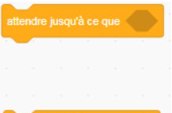
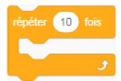
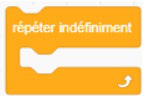
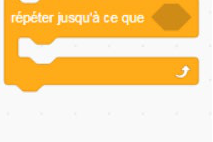

+++
title = "Les blocs Contrôle et les boucles"
weight = 5
+++

# Les blocs Contrôle

Certains blocs servent à contrôler l'exécution du programme : ils permettent de mettre en pause, d'arrêter un script précis ou l'ensemble des programmes.

Le bloc `attendre (1) secondes` met le programme en pause pendant un temps spécifié avant de continuer l'exécution des instructions suivantes.

Le bloc `attendre jusqu'à ce que <condition>` met lui aussi le programme en pause, mais au lieu d'attendre un temps fixe, il attend qu'une **condition** devienne vraie. Ce n'est pas une boucle : il ne répète rien, il se contente de retenir le script à un seul endroit jusqu'à ce que la condition soit remplie, puis le laisse continuer une seule fois.

# Les boucles

Dans un programme, certaines instructions doivent se répéter. Pour simplifier le code et éviter les redondances, on utilise des **boucles de répétition**. Ces blocs, en forme de parenthèse, entourent les instructions à répéter, soit un nombre de fois déterminé, soit indéfiniment, jusqu'à ce qu'une condition mette fin à leur exécution.

| Bloc | Effet |
|---|---|
| `répéter (10) fois` | Boucle de répétition dont le contenu s'exécute un nombre de fois déterminé. Une fois ce nombre atteint, le programme ne se répète plus. |
| `répéter indéfiniment` | Boucle de répétition dont le contenu s'exécute indéfiniment, ou jusqu'à ce qu'une condition mette fin à son exécution. Ce bloc est presque toujours utilisé avec des conditions afin que celles-ci soient continuellement vérifiées. |
| `répéter jusqu'à ce que <condition>` | Boucle de répétition dont le contenu s'exécute **en boucle**, tant que la condition n'est pas vraie. À chaque tour, la condition est revérifiée; dès qu'elle devient vraie, la boucle s'arrête. |

## Exercice — Lutin rebondissant et changeant de taille

**Contexte** : tu vas créer un lutin qui bouge automatiquement sur la scène et peut changer de taille selon les touches que l'utilisateur appuie.

**Objectifs** :

* Faire déplacer le lutin de gauche à droite indéfiniment.
* Lorsqu'il atteint le bord de la scène, il rebondit automatiquement.
* L'utilisateur peut appuyer sur des touches pour modifier la taille du lutin :
  * Une touche pour réduire la taille.
  * Une autre touche pour augmenter la taille.

**Consignes** :

* Utiliser les blocs de **Mouvement** : `avancer`, `rebondir si sur le bord`, `changer la taille de`.
* Utiliser les blocs d'**Événements** : `quand drapeau vert cliqué`, `quand touche pressée`.
* Utiliser une boucle **répéter indéfiniment** pour faire bouger le lutin.
* Choisir deux touches pour changer la taille du lutin (par exemple haut et bas).
