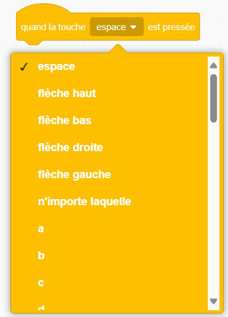
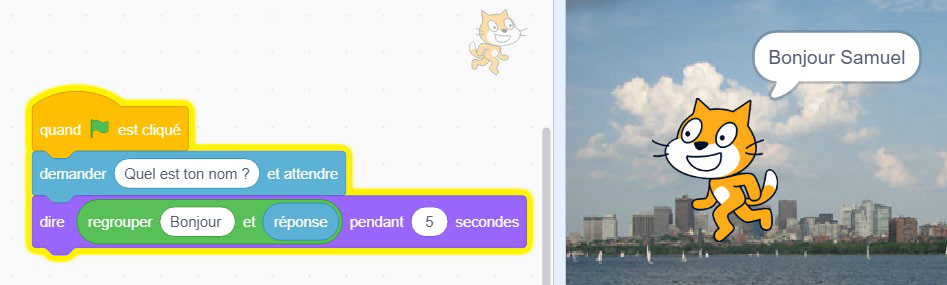
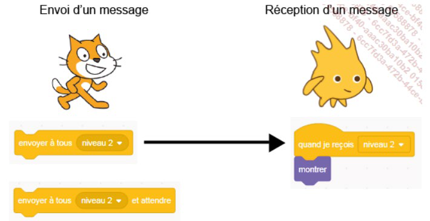

+++
title = "Les blocs Événements"
weight = 4
+++

# Les blocs Événements

Un programme se compose d'une série d'instructions qui sont lues et exécutées les unes après les autres, un peu comme les étapes d'une recette de cuisine. Une **procédure** (ou *script*) correspond à une partie de ce programme : elle contient des instructions destinées à déclencher des actions précises.

Lorsque plusieurs lutins et arrière-plans sont utilisés dans un même projet, il est nécessaire de créer des procédures propres à chacun, ainsi que des procédures permettant de coordonner leurs actions entre eux. Pour cela, on utilise les blocs des catégories **Événements** et **Contrôle**.

## Les principaux blocs d'événements

| Bloc | Effet |
|---|---|
| `quand [drapeau vert] cliqué` | Placé au début du programme, il déclenche l'exécution des instructions lorsqu'on clique sur le drapeau vert, qui sert de bouton de démarrage. |
| `quand la touche [espace] est pressée` | Exécute l'instruction attachée lorsqu'une touche spécifique du clavier est pressée. On peut choisir des touches directionnelles, alphabétiques ou numériques. |

## Exercice 1 — Déplacer un lutin avec le clavier

* Quand on clique sur la touche **flèche droite** du clavier, il faut faire avancer le lutin de 10 pas vers l'avant.
* Quand on clique sur la touche **flèche gauche**, il faut orienter le lutin vers la gauche et avancer de 10 pas.
* Quand on clique sur la touche **flèche haut**, il faut orienter le lutin vers le haut et avancer de 10 pas.
* Quand on clique sur la touche **flèche bas**, il faut orienter le lutin vers le bas et avancer de 10 pas.

---

# Utiliser les messages

Les messages servent à déclencher des actions, qu'elles soient communes ou propres à certains lutins ou arrière-plans.

* Un même message peut provoquer des réactions différentes selon les lutins, ou affecter également les arrière-plans.
* Seuls les lutins munis d'un bloc de réception (`quand je reçois [message]`) réagissent à un message envoyé ; les autres restent inactifs.
* Le bloc `envoyer à tous [message]` permet d'envoyer un message à tous les lutins du projet.

## Exercice 2 — Attrape le fantôme

**Objectif** : le joueur contrôle un lutin (par exemple un chat) avec les flèches pour attraper un fantôme qui se déplace aléatoirement.

Blocs à utiliser :

* `quand touche flèche gauche pressée` → ajouter -10 à x
* `quand touche flèche droite pressée` → ajouter 10 à x
* `quand touche flèche haut pressée` → ajouter 10 à y
* `quand touche flèche bas pressée` → ajouter -10 à y
* `quand je reçois [attraper]` → se cacher (pour le fantôme)

Événements à programmer :

* Si le chat touche le fantôme → envoyer un message au fantôme pour qu'il disparaisse et se repositionne ailleurs.

Indice: vous devez utiliser un bloc de type _Contrôle_ et un bloc de type _Capteur_.
