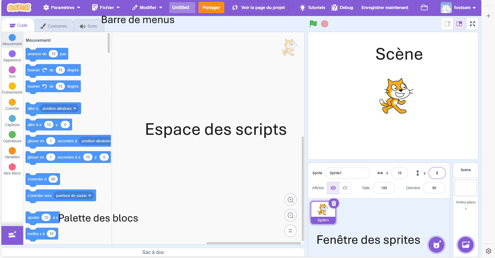
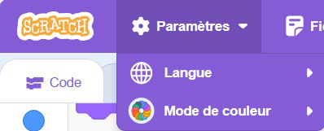
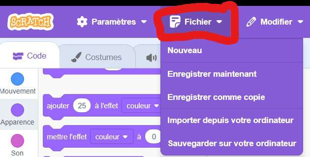
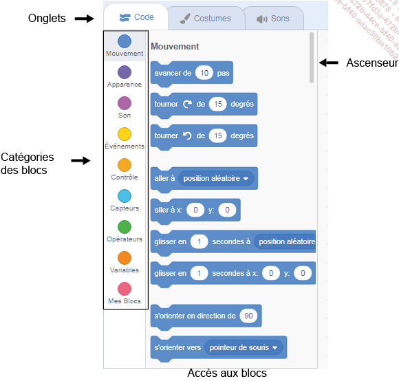

+++
title = "L'interface de Scratch"
weight = 2
+++

# L'interface de Scratch 3

L'interface de Scratch 3 est colorée, simple et pensée pour être facile à utiliser. Elle est divisée en plusieurs zones :

* La **barre de menus** est placée en haut de l'écran. Elle permet d'accéder aux principales options du logiciel.
* La **palette des blocs** est située à gauche. Elle regroupe tous les blocs classés par catégories pour créer des programmes.
* L'**espace des scripts** se trouve au centre. On y trouve la zone de programmation où les blocs sélectionnés viennent s'assembler.
* À droite, on retrouve :
  * La **scène** où le projet s'exécute.
  * La **fenêtre des sprites** (lutins) qui contient les personnages et objets.
  * La **fenêtre des arrière-plans** qui gère les décors du projet.

---

## La barre de menus

Placée en haut de l'écran, elle contient entre autres :

* Le logo **Scratch**, un raccourci vers la page d'accueil.
* Les **paramètres**, contenant une option pour changer la langue et le mode de couleur de l'écran.

### Le menu Fichier

* **Nouveau** : crée un projet vide pour repartir de zéro.
* **Importer** : ouvre un projet déjà enregistré sur l'ordinateur.
* **Sauvegarder sur l'ordinateur** : enregistre une copie locale du fichier `.sb3`.
* **Enregistrer maintenant** : sauvegarde le projet en ligne dans votre compte Scratch.
* **Enregistrer comme copie** : duplique le projet pour conserver différentes versions.

---

## La palette des blocs

Située à gauche de l'interface, la palette des blocs est composée de trois onglets :

* **Code** : les blocs pour créer ton programme.
* **Costumes / Arrière-plans** : pour changer et dessiner l'apparence des personnages ou du décor.
* **Sons** : pour ajouter ou modifier des bruits et de la musique.

---

## Catégories de blocs (onglet Code)

L'onglet Code contient plus de cent blocs de programmation, organisés en 9 catégories de couleurs différentes pour mieux les reconnaître :

1. **Mouvement** (bleu foncé) : permet de déplacer les personnages dans tous les sens sur la scène.
2. **Apparence** (violet) : sert à modifier l'aspect du personnage, le faire parler, disparaître ou appliquer des effets visuels.
3. **Son** (mauve) : permet d'ajouter des bruitages, de la musique et de gérer le volume.
4. **Événements** (jaune) : déclenche des actions quand un événement se produit, comme cliquer sur le drapeau vert ou une touche du clavier.
5. **Contrôle** (orange-jaune) : gère l'exécution du programme en ajoutant des conditions, des boucles ou des pauses.
6. **Capteurs** (turquoise) : détecte ce qui se passe (par exemple la position de la souris ou une touche pressée) et crée des interactions.
7. **Opérateurs** (vert) : réalise des calculs, compare des valeurs ou travaille sur du texte.
8. **Variables** (orange) : sert à stocker et utiliser des données comme un score, un temps ou une liste d'éléments.
9. **Mes blocs** (rose) : permet de créer ses propres blocs personnalisés pour réutiliser des séquences de code.

> 💡 On appelle un personnage ou un objet contrôlé par Scratch un **lutin** (en anglais, *sprite*).
