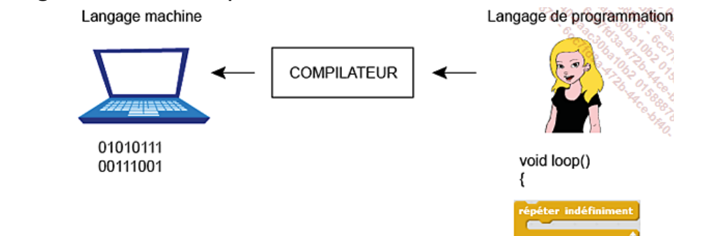

+++
title = "Qu'est-ce que la programmation?"
weight = 1
+++

# Qu'est-ce qu'un ordinateur et un logiciel?

* Sans logiciel, un ordinateur n'est qu'une **enveloppe vide**.
* Un **logiciel** correspond à une suite d'instructions que la machine peut exécuter.
* Le langage compris par l'ordinateur est le **langage binaire**, constitué uniquement de 0 et de 1.
* Pour donner des consignes à l'ordinateur, le développeur utilise un **langage de programmation**.
* Ce langage de programmation est plus proche de celui des humains, puisqu'il est formé de mots et de symboles.
* Afin d'être interprété et exécuté par l'ordinateur, le programme doit être converti en langage machine grâce à un **compilateur** (ou un interpréteur).

Un langage comme **Scratch** fonctionne exactement de la même façon : quand tu assembles des blocs et que tu cliques sur le drapeau vert, Scratch traduit ces blocs en instructions que l'ordinateur peut exécuter, tout comme un compilateur le ferait avec du code texte.

---

# Programmer avec Scratch

* **Scratch** est un langage visuel basé sur des blocs qui s'assemblent par glisser-déposer. Ces blocs, organisés en catégories, s'empilent comme des Lego pour créer des programmes **sans écrire de code texte**.
* Avec ses blocs colorés, Scratch facilite la programmation et permet de créer un projet dès la première utilisation.
* Scratch introduit les notions essentielles de la programmation :
  * les **variables**
  * les **conditions**
  * les **boucles**
  * les **événements**
* Scratch constitue une première étape avant de passer à des langages de programmation textuels plus complexes.
* Scratch est largement utilisé pour développer des jeux vidéo, des animations et des histoires interactives.

> Tous les concepts que nous allons voir avec Scratch (variables, conditions, boucles...) existent aussi dans les autres langages de programmation. Seule la façon de les écrire change!

## Où trouver Scratch?

Scratch est gratuit et fonctionne directement dans un navigateur web, sans installation. Rendez-vous sur [https://scratch.mit.edu/](https://scratch.mit.edu/) et cliquez sur **Créer** pour commencer un nouveau projet.
