+++
title = "Les blocs Mouvement"
weight = 3
+++

# Les déplacements relatifs

Les blocs de la catégorie **Mouvement** permettent de contrôler la position et les déplacements d'un lutin sur la scène, en précisant son orientation ou sa place par rapport aux autres personnages.

Les **déplacements relatifs** permettent de bouger un lutin par rapport à sa propre position actuelle, sans utiliser les coordonnées de la scène. Trois blocs servent à réaliser ce type de mouvement en indiquant un nombre de pas (par défaut 10), qui correspond à l'unité de déplacement sur la scène.

| Bloc | Effet |
|---|---|
| `avancer de (10) pas` 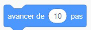 | Le lutin se déplace vers l'avant selon le nombre de pas indiqué. Si la valeur est négative, le déplacement se fait en arrière (avancer de -10 pas revient à reculer). |
| `ajouter (10) à x` 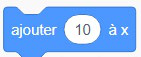 | Modifie la position `x` du lutin. Le lutin se déplace horizontalement vers la droite si la valeur est positive, vers la gauche si elle est négative. |
| `ajouter (10) à y` 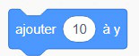 | Modifie la position `y` du lutin. Une valeur positive le fait monter, une valeur négative le fait descendre. |

## Exercice 1 — Le carré

Programme un lutin pour qu'il se déplace en carré de côté 100 pas, en utilisant les blocs de mouvement et de rotation.

## Exercice 2 — Le S

Programme un lutin pour qu'il dessine un **S** en avançant par bonds de 50 pas, en prenant une pause d'une seconde à chaque bond. Chaque ligne horizontale et verticale équivaut à 100 pas.

---

# Orientation et rotation

Le bloc `s'orienter à ( )` fixe directement l'orientation du lutin sur la scène, peu importe sa direction actuelle, selon un angle donné en degrés. On l'utilise par exemple pour donner une direction de départ au lutin, ou pour le réorienter précisément après un événement (toucher un bord, suivre la souris, suivre un autre lutin, etc.). *(La signification exacte des degrés est expliquée plus bas, dans la section [Rotation](#rotation).)*

> 💡 Pour faire rebondir le lutin quand il touche le bord, on utilise plutôt le bloc `rebondir si le bord est touché`.

Le bloc `fixer le sens de rotation` détermine comment l'apparence du lutin réagit lorsque son orientation change (par exemple après un rebond). Trois modes sont possibles, mais le plus courant est le mode **gauche-droite**, qui donne un effet réaliste aux déplacements.

Le bloc `pointer vers` oriente le lutin soit vers le pointeur de la souris, soit vers un autre lutin choisi dans la liste déroulante des éléments du projet.

Le bloc `fixer le sens de rotation` permet de choisir comment le lutin réagit après un rebond : en mode **gauche-droite**, il se retourne simplement comme un miroir; en mode **ne tourne pas**, il garde toujours la même apparence.

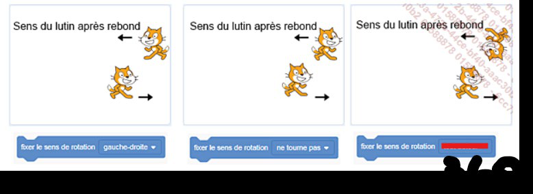
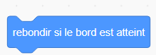

### Exemples : combiner rotation et orientation

Voici deux scripts qui combinent `fixer le sens de rotation` avec `s'orienter vers`, pour illustrer la différence entre les modes de rotation :

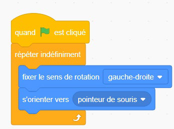
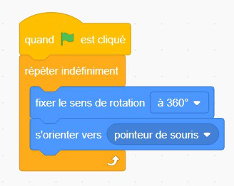

## Rotation

| Bloc | Effet |
|---|---|
| `tourner ↻ de (15) degrés` | Fait pivoter le lutin dans le sens des aiguilles d'une montre. |
| `tourner ↺ de (15) degrés` | Fait pivoter le lutin dans le sens contraire des aiguilles d'une montre. |
| `s'orienter à (90)` | Définit directement la direction du lutin, sans tenir compte de son orientation actuelle (contrairement à `tourner`, qui fait pivoter le lutin *par rapport à* sa direction actuelle). |

Le bloc `s'orienter à` fonctionne comme un **cadran circulaire** gradué de -180° à 180°, avec le **0° pointant vers le haut** de la scène :

* **0°** → le lutin regarde vers le **haut** ⬆️
* **90°** → le lutin regarde vers la **droite** ➡️
* **180°** (ou **-180°**) → le lutin regarde vers le **bas** ⬇️
* **-90°** → le lutin regarde vers la **gauche** ⬅️

Autrement dit, les degrés augmentent dans le sens des aiguilles d'une montre à partir du haut, et deviennent négatifs si on tourne dans le sens inverse. Toutes les valeurs intermédiaires sont aussi possibles : par exemple, `s'orienter à (45)` pointe le lutin en diagonale, vers le haut-droite.

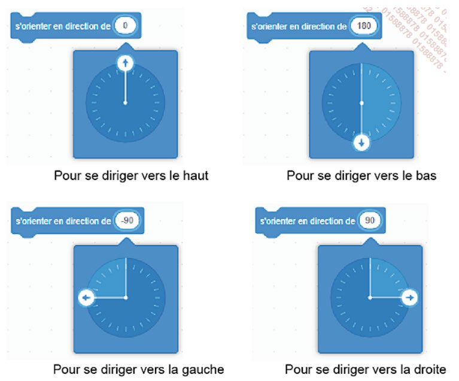

---

# Les déplacements absolus

Les déplacements en valeurs **absolues** permettent de positionner un lutin à un endroit précis de la scène grâce à des coordonnées `x` et `y`.

* La scène mesure **480 pas** de large et **360 pas** de haut, avec pour centre le point `(x = 0, y = 0)`.
* Les coordonnées sont **positives** vers la droite et vers le haut, et **négatives** vers la gauche et vers le bas.

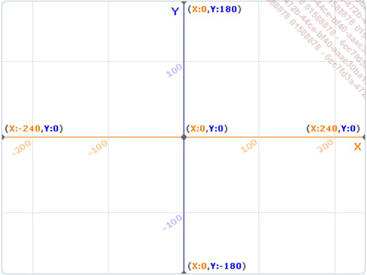

| Bloc | Effet |
|---|---|
| `aller à x:(0) y:(180)` 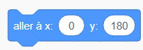 | Le lutin se déplace instantanément à la position (0, 180). |
| `mettre x à (40)` 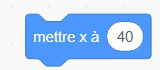 | Déplace le lutin horizontalement à une valeur `x` précise (entre -240 et +240). L'ancienne position `x` est remplacée par la nouvelle valeur. |
| `mettre y à (180)` 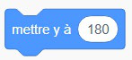 | Déplace le lutin verticalement à une valeur `y` précise (entre -180 et +180). |
| `glisser en (1) secondes à x:() y:()` 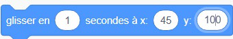 | Le lutin glisse en douceur vers les coordonnées indiquées. Plus la durée est longue, plus le déplacement est lent. |

## Autres blocs de mouvement

* `aller à (position aléatoire)` ou `aller à (pointeur de la souris)` : positionne le lutin instantanément.

  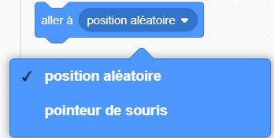
* `glisser à (position aléatoire)` ou `glisser à (pointeur de la souris)` : déplace le lutin en douceur.

  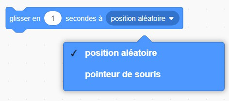

## Exercice 3 — Va-et-vient

Programme un lutin qui glisse doucement d'un bout à l'autre de la scène :

* glisse en 1 seconde vers le coin droit de la scène (`x:200 y:0`);
* glisse en 1 seconde vers le coin gauche de la scène (`x:-200 y:0`).

*Indice : utilise uniquement le bloc `glisser en () secondes à x:() y:()` vu dans cette page — pas besoin de boucle pour cet exercice.*
