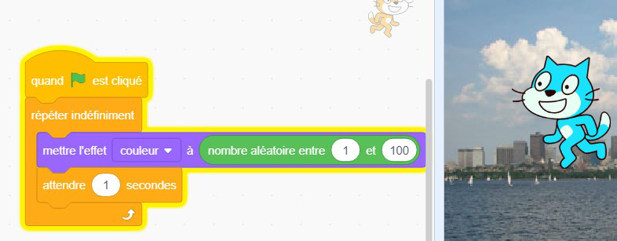
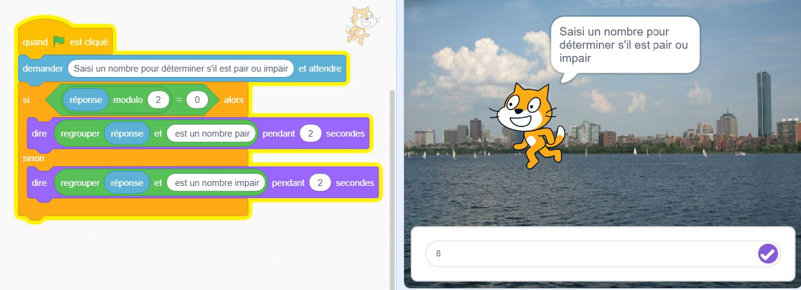
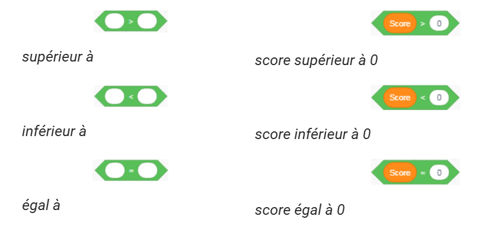
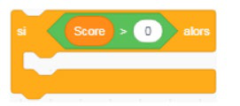
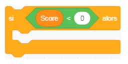
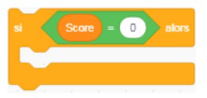

+++
title = "Les blocs Opérateurs"
weight = 8
+++

# Les blocs Opérateurs

Un programme peut avoir besoin d'effectuer des calculs, qu'il s'agisse d'opérations mathématiques, de calculs géométriques ou de comparaisons de valeurs. Les blocs **Opérateurs**, reconnaissables à leur forme arrondie, s'insèrent dans les zones de saisie d'autres blocs et peuvent aussi s'emboîter entre eux.

## Les blocs mathématiques

| Bloc | Effet |
|---|---|
| `() + ()`, `() - ()`, `() * ()`, `() / ()` | Les quatre opérations mathématiques de base. |
| `nombre aléatoire entre () et ()` | Sélectionne au hasard un nombre situé dans la fourchette des valeurs spécifiées. |
| `() mod ()` | Le **modulo** est le reste de la division. Par exemple, si le modulo d'un nombre par 2 est égal à 0, c'est un nombre pair; sinon, c'est un nombre impair. |
| `arrondi de ()` | Arrondit un nombre décimal à l'entier le plus proche. |

## Les blocs de comparaison

Pour définir des conditions booléennes, les blocs de comparaison s'insèrent dans les blocs de la catégorie Contrôle (`si`, `répéter jusqu'à ce que`, `attendre jusqu'à ce que`, etc.).

| Bloc | Effet |
|---|---|
| `() > ()` | Renvoie « vrai » si la première valeur est plus grande que la seconde. |
| `() < ()` | Renvoie « vrai » si la première valeur est plus petite que la seconde. |
| `() = ()` | Renvoie « vrai » si les deux valeurs sont égales. |

### Exemples avec une variable Score

Ces trois scripts montrent comment utiliser les opérateurs de comparaison avec une variable `Score` à l'intérieur d'un bloc `si...alors` :

## Les opérateurs logiques

| Bloc | Effet |
|---|---|
| `<> et <>` | Le programme associé ne s'exécute que si **les deux** conditions sont vraies. |
| `<> ou <>` | Le programme s'exécute si **au moins l'une** des deux conditions est vraie. |
| `pas <>` | Renvoie « vrai » lorsque la condition n'est **pas** remplie, et « faux » lorsqu'elle l'est. |

---

# Exercices

### Exercice 1 — Nombre pair ou impair

Quand on clique sur le drapeau vert, demande à l'utilisateur un nombre. Utilise l'opérateur modulo (`nombre mod 2`) pour vérifier s'il est pair ou impair. Affiche "Ton nombre est pair" ou "Ton nombre est impair".

*Objectif : pratiquer l'opérateur modulo avec une condition.*

### Exercice 2 — Mot de passe simple

Quand on clique sur le drapeau vert, demande "Quel est le mot secret ?". Si le texte entré = "chat", dire "Accès autorisé". Sinon, dire "Accès refusé".

*Objectif : utiliser l'opérateur `=` dans une condition.*

### Exercice 3 — Plus grand ou plus petit

Quand on clique sur le drapeau vert, demande un nombre. Si ce nombre est > 10, dire "Grand nombre". Sinon, dire "Petit nombre".

*Objectif : utiliser `>` et `<` avec une condition.*

### Exercice 4 — Jeu du nombre magique

Quand on clique sur le drapeau vert, demande "Choisis un nombre entre 1 et 5". Si le nombre est = 3, dire "Bravo, tu as trouvé !". Sinon, dire "Essaie encore".

*Objectif : condition avec `=`.*

### Exercice 5 — Nombre secret avec plage

Génère un `nombre aléatoire entre (1) et (10)` et stocke-le dans une variable `secret`. Demande à l'utilisateur de deviner. Utilise `et` pour vérifier si sa réponse est comprise entre 1 et 10, sinon dis "Choisis un nombre entre 1 et 10 !".

*Objectif : combiner opérateur logique `et` avec des comparaisons.*
