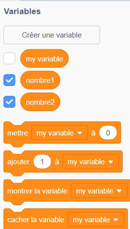
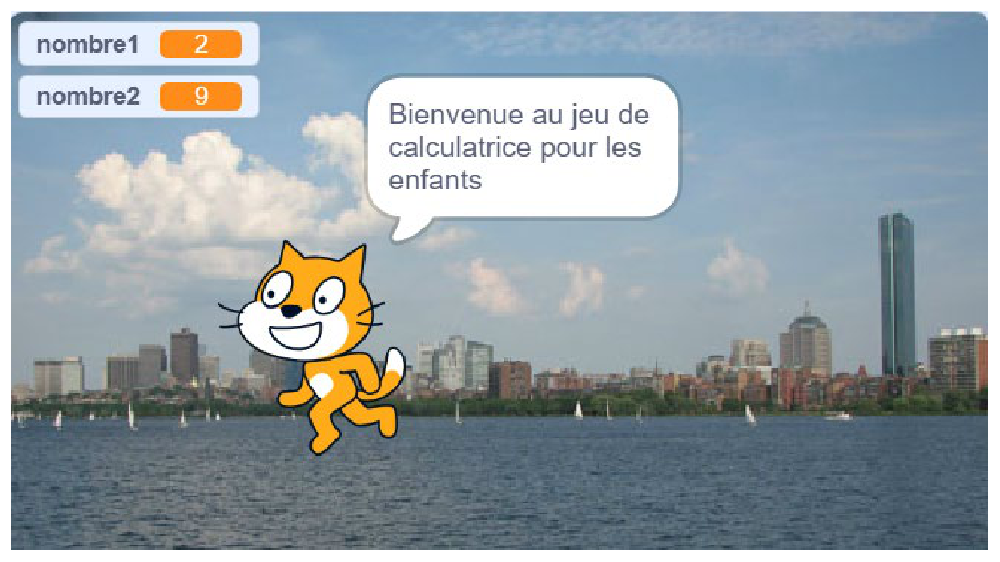

+++
title = "Les variables et les listes"
weight = 9
+++

# Les variables

Qu'il s'agisse d'une animation ou d'un jeu, un projet nécessite l'utilisation de données qui sont stockées et mises à jour au fil de l'exécution du programme. Ces données peuvent être des **variables** ou des **listes**.

Une **variable** associe un nom à une valeur. Par exemple, la variable `score` représente un nombre de points. Cette valeur n'est pas fixe : les variables sont **dynamiques** et peuvent changer au cours du temps.

## Créer une variable

Dans la catégorie **Variables**, on clique sur **Créer une variable**, puis on lui donne un nom clair (par exemple `score`, `vie` ou `nom`). On peut choisir si la variable est accessible :

* **pour tous les lutins** (partagée par tout le projet);
* **pour ce lutin uniquement** (propre à un seul personnage).

## Les blocs Variables les plus courants

| Bloc | Effet |
|---|---|
| `mettre [score] à (0)` | Donne une valeur précise à la variable, en remplaçant l'ancienne valeur. On l'utilise souvent au début du programme pour initialiser une variable. |
| `changer [score] de (1)` | Augmente (ou diminue, avec une valeur négative) la variable de la quantité indiquée, sans écraser sa valeur actuelle. |
| `afficher la variable [score]` / `cacher la variable [score]` | Affiche ou cache le compteur de la variable sur la scène. |
| `[score]` | Le bloc rond représentant la variable peut être inséré dans d'autres blocs pour lire sa valeur actuelle (par exemple dans un bloc `dire` ou une condition). |



> ⚠️ Il est important de bien **initialiser** une variable (lui donner une valeur de départ avec `mettre à`) au début du programme, sinon elle pourrait garder une ancienne valeur d'une exécution précédente.

## Exemple : un compteur de points

```
quand [drapeau vert] cliqué
mettre [score] à 0

quand le lutin est cliqué
changer [score] de 1
```

---

# Projet complet : une calculatrice pour les enfants

Voici un exemple complet qui combine variables, capteurs, opérateurs et conditions dans un vrai petit jeu : une calculatrice qui pose des questions d'addition à l'utilisateur.

**Étape 1 — Créer les variables.** On crée deux variables `nombre1` et `nombre2`, qui contiendront chacune un nombre aléatoire.

**Étape 2 — Message de bienvenue.**



**Étape 3 — Expliquer la consigne.**


**Étape 4 — Attendre que l'utilisateur soit prêt.**


**Étape 5 — Générer deux nombres aléatoires et poser la question.** On utilise le bloc `nombre aléatoire entre () et ()` pour donner une nouvelle valeur à `nombre1` et à `nombre2`, puis on assemble une phrase avec `demander () et attendre` :

```
demander (assembler (assembler (assembler ("Quel est le résultat de: ") (nombre1)) (" + ")) (nombre2)) et attendre
```


**Étape 6 — Vérifier la réponse avec une condition `si...sinon`.** On compare la `réponse` de l'utilisateur avec `nombre1 + nombre2` :

```
si (réponse) = ((nombre1) + (nombre2)) alors
    dire (assembler ("Bravo, le résultat est bien ") ((nombre1) + (nombre2))) pendant 2 secondes
sinon
    dire (assembler ("Malheureusement, tu n'as pas trouvé la bonne réponse. La réponse attendue était ") ((nombre1) + (nombre2))) pendant 2 secondes
```

**Bonne réponse :**


**Mauvaise réponse — l'enfant tente sa chance :**


**Message d'erreur avec la bonne réponse affichée :**


> 💡 Ce projet illustre bien comment **variables** (`nombre1`, `nombre2`), **opérateurs** (`nombre aléatoire`, `+`, `=`), **capteurs** (`demander`, `réponse`) et **conditions** (`si...sinon`) travaillent ensemble pour créer un vrai petit programme interactif.

---

# Les listes

Une **liste** permet de stocker plusieurs valeurs dans une seule structure, un peu comme une rangée de cases numérotées. Par exemple, une liste `notes` peut contenir plusieurs notes d'examen.

## Les blocs Listes les plus courants

| Bloc | Effet |
|---|---|
| `ajouter () à [notes]` | Ajoute un élément à la fin de la liste. |
| `supprimer (1) de [notes]` | Supprime l'élément à une position donnée de la liste. |
| `supprimer tout de [notes]` | Vide complètement la liste. |
| `insérer () à (1) de [notes]` | Insère un élément à une position précise. |
| `remplacer l'élément (1) de [notes] par ()` | Remplace la valeur d'un élément existant. |
| `élément (1) de [notes]` | Renvoie la valeur stockée à une position donnée de la liste. |
| `longueur de [notes]` | Renvoie le nombre d'éléments contenus dans la liste. |
| `[notes] contient ()?` | Renvoie « vrai » si la valeur recherchée se trouve dans la liste. |

## Exemple : parcourir une liste

```
mettre [i] à 1
répéter (longueur de [notes]) fois
    dire (élément (i) de [notes]) pendant 1 seconde
    changer [i] de 1
```

Ce script affiche, une à une, toutes les valeurs contenues dans la liste `notes`. Cette technique s'appelle **parcourir une liste** et est très utile pour traiter plusieurs valeurs à la suite.
