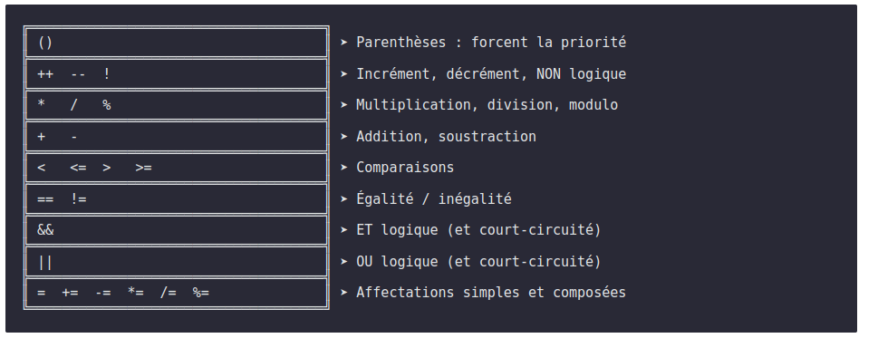

+++
date = '2025-08-20T19:02:52-04:00'
title = 'Série 8'
weight = 8
+++

# 🔴 NIVEAU 8 — BOSS : RÉVISION

### 📜 Histoire

*Tu as vaincu 7 niveaux! Ce niveau boss combine tout ce que tu as appris : variables, opérateurs, booléens... Un vrai test de tes compétences avant de continuer l'aventure!*

💎 Points : /8 — 👑 Difficulté : boss

---

## Examen préparatif 1 partie théorique ( /8)

## Question 1 ( /2):

Quelle est la sortie attendue de ce bout de code : 

```java
boolean calcul = 18 % 5 + 1 == 4 && !(2 * 2 >= 5);
System.out.println("Résultat : " + calcul)
```

## Question 2 ( /1)
Déclare une variable qui servira à enregistrer des nombres entier entre -120 et 31 000? (Nomme-la simplement variable)

## Question 3 ( /2)

Écris le résultat du raccourci `psvm` en java

## Question 4 ( /3)

Encercle 3 des erreurs dans le code suivant et donne une courte explication. Si une erreur se répète, elle ne compte qu'une fois.

```java
    int a = 5;
    int b = 5;
    int c = 5;

    if(a == b || a == c){
        System.out.println("Triangle équilatéral");
    } else if((a == b) || (a == c) || (b == c)){
        System.out.println("Triangle isocèle")
    } else{
    System.out.println("Triangle scalène");
    }
```


## Examen préparatif 1 partie pratique (  /12)

## 🧩 **Exercice 1 — Analyse de note** (/3)

**Concepts** : `if-else`, `if-elseif`, opérateurs de comparaison, opérateurs logiques, conversion, arguments du programme.

### Énoncé

Écris un programme `NoteApp.java` qui :

1. Reçoit une **note** (sur 100) en **argument de ligne de commande** (`args[0]`).
1. Affiche :

   * `"Échec"` si la note est < 60
   * `"Passable"` si entre 60 et 69
   * `"Bien"` si entre 70 et 84
   * `"Excellent"` si >= 85
1. Si la note est supérieure à 100 ou inférieure à 0, affiche `"Note invalide"`.

### Exemple

```
> java NoteApp 78
Bien
```

---

## 🧮 **Exercice 2 — Calculatrice simple** (  /4)

**Concepts** : `switch`, opérateurs arithmétiques, conversion, arguments.

### Énoncé

Crée un programme `Calculatrice.java` qui :

1. Reçoit **trois arguments** :

   * le premier nombre
   * un opérateur (`+`, `-`, `x`, `/`)
   * le deuxième nombre
2. Utilise un **switch** pour effectuer l’opération.
3. Affiche le résultat.
4. Gère la division par zéro avec un message d’erreur.

### Exemple

```
> java Calculatrice 8 x 3
Résultat : 24
```

---

## 🔢 **Exercice 3 — Statistiques sur un tableau 2D**(  /5)

**Concepts** : `tableau`, `matrice`, `if-else`, opérateurs logiques/comparaison.

### Énoncé

Écris un programme `MatriceStats.java` qui :

1. Déclare une **matrice d’entiers** 2x2 contenant les valeurs suivantes :
    3  7
    0 -2
2. Calcule et affiche la somme totale des éléments
   
3. Si la somme est **paire**, affiche `"Somme paire"`, sinon `"Somme impaire"`.
4. Si **tous les éléments sont positifs**, affiche `"Tous positifs"`, sinon `"Il y a des valeurs négatives"`.
5. Affiche le maximum sans hardcoder (Difficile)(2 pts)

*Vous pouvez assumer que vous aurez toujours une 2x2


### Exemple

```java
int[][] mat = {
  {3, 7},
  {0, -2},
  
};
```

Sortie possible :

```
Somme : 8
Somme pair
Il y a des valeurs négatives
Max : 7
```

---

{}