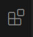
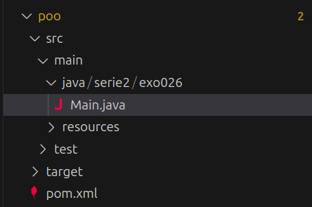

+++
date = '2025-08-28T21:15:14-04:00'
title = 'Maven & VSCode'
draft = 'true'
+++

Nous allons utiliser la structure de projet recommandée par [Maven](https://maven.apache.org/guides/introduction/introduction-to-the-standard-directory-layout.html).

### Installation de l'extension **Maven for Java**

1. Ouvrez la barre latérale de gauche dans VSCode.
2. Cliquez sur l'icône des extensions  ou utilisez le raccourci clavier `Ctrl + Shift + X`.
3. Recherchez **Maven for Java** et installez l’extension.

### Création d’un projet Maven

Une fois l’extension installée :

1. Dans l’explorateur de fichiers de VSCode, faites un clic droit.
2. Sélectionnez : `Maven` → `New Project`.
3. Choisissez l’option **No Archetype**.

VSCode vous demandera ensuite de saisir plusieurs informations :

- **Group ID** : identifiant unique de votre organisation ou projet (ex. `com.example`). Mettez n'importe quoi pour l'instant.
- **Artifact ID** : nom du projet (il correspond au nom du dossier créé).
- **Version** (optionnelle) : laissez la valeur par défaut sauf si besoin spécifique.

Une fois le projet créé, vous devriez voir une structure de dossier semblable à ceci :

## Exemple

**Group ID** : serie2.exo026

**Artifact ID** : poo

---

### Ouverture du projet dans VSCode

Une fois le projet créé, assurez-vous d’**ouvrir le dossier racine** du projet dans VSCode.
Dans l’explorateur (à gauche), le dossier tout en haut doit être celui contenant les sous-dossiers `src`, `pom.xml`, etc.

> 💡 Astuce : si vous êtes à l’aise avec le terminal, vous pouvez faire un clic droit sur le dossier du projet → **"Open in Integrated Terminal"**, puis taper `code .` pour ouvrir le projet dans une nouvelle fenêtre VSCode.

### Organisation du code

* Tout votre code Java doit se trouver dans le dossier `src/main/java/`.
* Un sous-dossier est généralement créé automatiquement à l’intérieur de `java/` (en fonction du `groupId` et `artifactId` fournis).
  Vous pouvez **le supprimer**, nous ne l'utiliserons pas cette session.

### Exécuter votre code

Une fois un fichier `.java` ouvert (contenant une méthode `main`), vous pouvez l’exécuter facilement en cliquant sur le bouton ▶️ **"Run"** situé en haut à droite de l’éditeur.

Créez un fichier HelloWorld.java dans le dossier src/main/java/